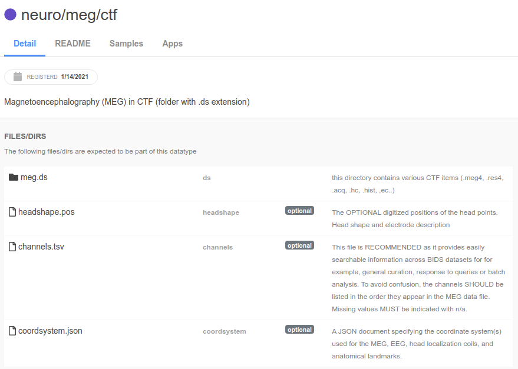
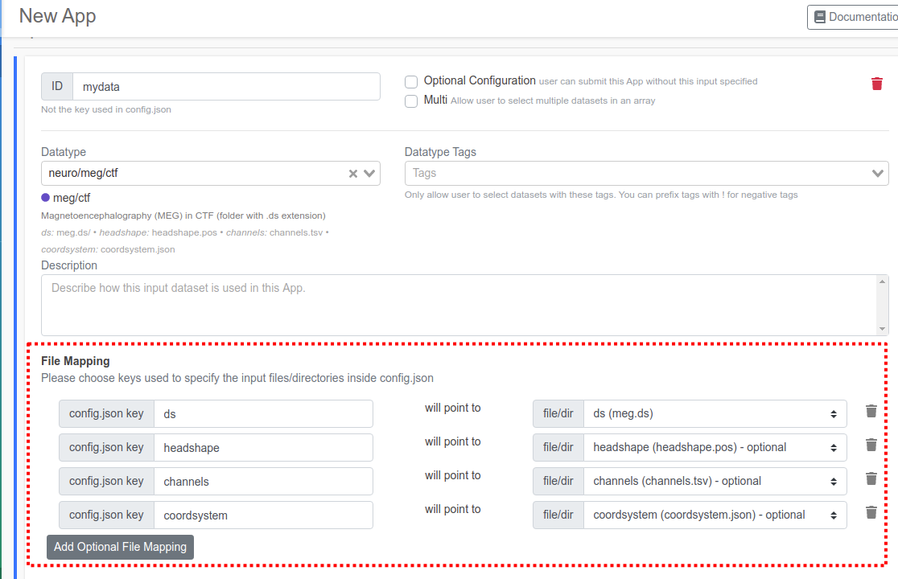

!!! note "Prerequisites"
    Please read [App Developers / Introduction](/docs/apps/introduction) first. 
    
    Before you begin, please install a text editor such as [VSCode](https://code.visualstudio.com) and [git client](https://git-scm.com/downloads) on your laptop. You will also need to install [jq](https://stedolan.github.io/jq/download/) and [nibabel](https://nipy.org/nibabel/), which will be explained later.

# HelloWorld

Here, we will create a "HelloWorld" Brainlife App. 

We will show how to create a brand new [github repository](https://help.github.com/articles/creating-a-new-repository/) containing a Brainlife App. Please be sure to make the repo public so that the [brainlife.io](https://brainlife.io/) platform will be able to access it. You can name the repository as you prefer, the Brainlife Team has been naming apps starting with the prefix `app-`, for example, take a look at [these Apps](https://github.com/search?q=org%3Abrain-life+app-).

As a start we will create a HelloWorld App, i.e., `app-helloworld`, [here is an example](https://github.com/francopestilli/app-helloworld). [Git clone](https://help.github.com/articles/cloning-a-repository/) your new repository on your local machine - where you will be developing/editing and testing your App.

```
git clone git@github.com:francopestilli/app-helloworld.git
```
or (depending on your www.github.com settings):
```
git clone https://github.com/francopestilli/app-helloworld.git
```

Now, cd inside the local directory of the repository and create a file called `main`. This file contains some information about the UNIX environment ([bash-related collands](https://en.wikipedia.org/wiki/Bash_(Unix_shell))), the procedure to submit jobs in a cluster environment ([PBS-related commands](https://kb.iu.edu/d/avmy)), parsing inputs from the config.json file using `jq` (see [here](https://stedolan.github.io/jq/) for more information about `jq`). For example:
```
touch main
```

#### main
After creating the file `main` inside your local folder for the github repository app-helloworld, we will edit the content of the file and make it executable. Use your preferred editor and edit the file. Copy the text below inside the edited `main` file, and save it back to disk.

```bash
#!/bin/bash

#PBS -l nodes=1:ppn=1
#PBS -l walltime=00:05:00

#parse config.json for input parameters (here, we are pulling "t1")
t1=$(jq -r .t1 config.json)
./app.py $t1
```

Please be sure to set the file `main` is executable. You can do that by running the following command in a terminal, before pushing to the github repository.

```bash
chmod +x main
```

Finally, `add` the file to the git repository and `commit` to github.com by running the following:

  `git add main`
  
  `git commit -am "Added main file"`
  
  `git push`

!!! note
    [`jq`](https://stedolan.github.io/jq/) is a command-line tool used to parse a small JSON file and pull values out of it. You can install it on your machine by running something like `apt-get install jq` or `yum install jq` or `brew install jq` depending on your Operative System (OS) or OS distribution. Also note that thee Brainlife computational resources (Cloud) where that App will need to run, will need to have common binaries installed including `bash`, `jq`, and `singularity`. 

!!! info "For Mac Users"
    You will need to have [the XCODE, Apple Development Tools](https://developer.apple.com/xcode/) and [homebrew](https://brew.sh/) to install `jq`. Once Xcode is installed run this command `/usr/bin/ruby -e "$(curl -fsSL https://raw.githubusercontent.com/Homebrew/install/master/install)"` and then this command `brew install jq` in a terminal.

The first few lines in our `main` instruct PBS or Slurm batch systems to request a certain number of nodes/processes to our App. 

```bash
#PBS -l nodes=1:ppn=1
#PBS -l walltime=00:05:00
```


The following lines parse the `config.json` (explained below) using `jq` and the value of `t1` to the main part of the application which we will create later.

```bash
#parse config.json for input parameters
t1=$(jq -r .t1 config.json)
./app.py $t1
```

To be able to test your application, let's create a test `config.json`.

#### config.json

```json
{
   "t1": "~/data/t1.nii.gz"
}
```

On brainlife.io, all input parameters (configurations and paths to input data) are communicated to your App through `config.json`. This file is created by brainlife.io on the root directory of your App (where the `main` script is) when a user submits your App. To develop and test your App, you will need to create this file manually and design your code to read any configuration parameters or paths to your input data from this file. 

There are several ways to load / parse `config.json`. For bash script, you can install and use a command called [`jq`](https://stedolan.github.io/jq/) as we have shown above. 

For python, you can use `json.load()` method. 

```
import json
with open('config.json) as f:
    config = json.load(f)
print("my path to t1w is ", config["t1"])
```

On Matlab, you can use [`jsondecode`](https://www.mathworks.com/help/matlab/ref/jsondecode.html).
```
config = jsondecode(fileread('config.json'));
disp(config.t1)
```

For our example, please update the path for `t1` to wherever you have your test anatomy input file. If you don't have any, you can download one from the [Open Diffusion Data Derivatives](https://brainlife.io/pub/5a0f0fad2c214c9ba8624376) publication page. Just click the Datasets tab, and select any `anat/t1w` data to download. Then create a directory in your home directory and move the t1w.nii.gz file in there and unpack it:
 
`cd ~`

`mkdir data`

`cp -v /path/to/your/downloaded/5a050966eec2b300611abff2.tar ~/data/`

`tar -xvf ~/data/5a050966eec2b300611abff2.tar`

At this point, `~/data/` should contain a file named t1w.nii.gz. Next, you should add `config.json` to [.gitignore](https://help.github.com/articles/ignoring-files/) as `config.json` is created at runtime by Brainlife, and we just need this now to test your app. 

!!! hint
    A good pattern might be to create a file called `config.json.sample` used to test your App, and create a symlink `ln -s config.json config.json.sample` so that you can run your app using `config.json.sample` without including the actual `config.json` as part of your repo. This allows other users to construct their own `config.json` if they want to run your app via command-line.

#### What files can I expect to find in `config.json`?

The above example assume that we are feeding [`neuro/t1w`](https://brainlife.io/datatype/58c33bcee13a50849b25879a) datatype. But what about other datatypes? 

As a developer of an App, later you will register a list of configuration parameters and input data types to feed to your App. Please look through the [list of datatypes](https://brainlife.io/datatypes) currently registered on brainlife, and for each datatype you can see a list of files / directories available for each datatype. 

For example, [`neuro/meg/ctf`](https://brainlife.io/datatype/6000714baacf9e22a6a691c8) datatypes has a `meg.ds` directory and a few other optional files.



When you registere your App, you not only specify which datatype to use, but you will also decide what to call each of those files/directories in your `config.json`. 

The registration for your App might look like this..



The *File Mapping* section determines which files/dirs will be mapped to which *key* within your json file. When a user submit your App, brainlife.io will create `config.json` that looks like the following.

```
{
    "ds": "... a path to meg.ds directory",
    "headshape": "... a path to headshape.pos file",
    "channels": "... a path to channels.tsv",
    "coordsystem": "... apath to coordsystem.json"
}
```

As you can tell from the datatype registration, the only *required* files in this datatype is the `meg.ds` directory, so other files maybe missing and your App will need to check if they actually exists (the filepath might be invalid or points to a missing file).

If you have 2 input data objects with the same datatype, you might want to name the keys for either input differently so that your App can distinguish them (say "ds1" and "ds2", for example)

#### app.py

Our `main` script runs a python script called `app.py` so let's create it and edit it by copying the content reported below.

`cd ~/git/app-helloworld`

`touch app.py`

```
#!/usr/bin/env python

import sys
import nibabel as nib

#just dump input image header to output.txt
img=nib.load(sys.argv[1])
f=open("output.txt", "w")
f.write(str(img.header))
f.close()

```

Again, be sure to make `app.py` also executable.

```
chmomd +x app.py
```

Finally, `add` the file to the git repository and `commit` to github.com by running thee following:

  `git add main`
  
  `git commit -am "Added app.py file"`
  
  `git push`
  
Any output files from your app should be written to the current working directory and in a file structure that complies with whichever the datatype of your dataset is. For now, we are not going to worry about the output datatype (assuming we will use `raw`)

Please be sure to add any output files from your app to .gitignore so that it won't be part of your git repo. 

#### .gitignore

```
config.json
output.txt
```

!!! note
    .gitignore is a text file that instructs git to not track certain files inside your work directory. Please see [ignoring files](https://help.github.com/articles/ignoring-files/)

## Testing

Now, you should be able to test run your app locally by executing `main` ([nibabel](https://nipy.org/nibabel/) should be installed first, e.g. by executing `pip install nibabel`)

```
./main
```

<!--
!!! hint
    If you are testing on HPC clusters, be sure to enter the interactive shell session before running your `main` by executing something like `qsub -I`
-->

Now, it should generate an output file called `output.txt` containing the dump of all nifti headers.

```
<class 'nibabel.nifti1.Nifti1Header'> object, endian='<'
sizeof_hdr      : 348
data_type       : 
db_name         : 
extents         : 0
session_error   : 0
regular         : r
dim_info        : 0
dim             : [  3 260 311 260   1   1   1   1]
...
...
...
qoffset_x       : 90.0
qoffset_y       : -126.0
qoffset_z       : -72.0
srow_x          : [ -0.69999999   0.           0.          90.        ]
srow_y          : [   0.            0.69999999    0.         -126.        ]
srow_z          : [  0.           0.           0.69999999 -72.        ]
intent_name     : 
magic           : n+1
```

## Pushing to Github

If everything looks good, push our files to Github.

```bash
git add .
git commit -m"created my first BL App!"
git push
```

Congratulations! We have just created our first Brainlife App. To summarize, we've done the following.

* Created a new public Github repo.
* Created `main` which parses `config.json` and runs our App.
* Created a test `config.json`.
* Created `app.py` which runs our algorithm and generate output files.
* Tested the App, and pushed all files to Github.

!!! info
    You can see more concrete examples of Brainlife apps at [Brainlife hosted apps](https://github.com/search?q=org%3Abrain-life+app-).

To run your App on Brainlife, you will need to do the following.

1. [Register your App on Brainlife.](/docs/apps/register/)

2. Enable your App on at least one Brainlife compute resource. 

    For now, please email [brlife@iu.edu](mailto:brlife@iu.edu) to enable your App on our shared test resource.

<!--
All input parameters are assumed to be text (char). You need to write your functions that are going to be MATLAB compiled with all the arguments as text. Arguments passing a number need to be given as text and within the function converted to integers values (str2num(), etc.). 
-->
