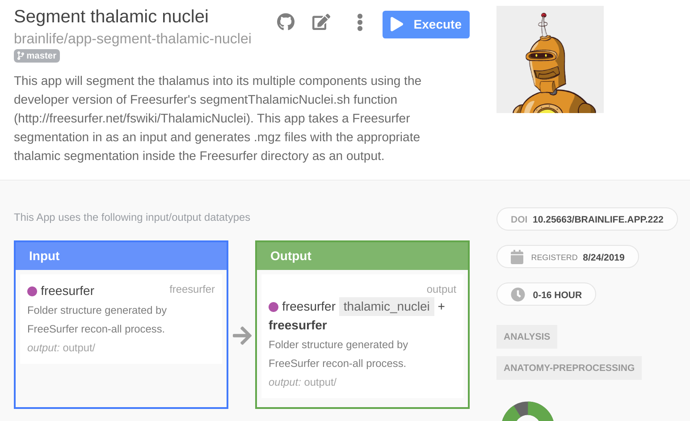
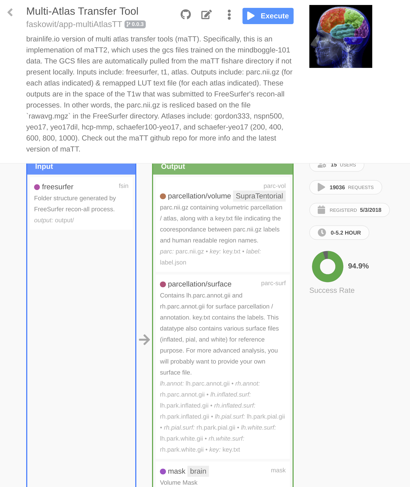

If you're happy with the results, then you're ready to move onto the next step: Thalamic nuclei segmentation!

### 4. Thalamic nuclei segmentation.

The next step is segment the multiple regions (i.e. nuclei) of the thalamus, each with it's own distinct functional properties. For more information about the different thalamic nuclei, please see http://freesurfer.net/fswiki/ThalamicNuclei.

The best [brainlife.io](https://brainlife.io) app to perform this task is:

| |
|------------------------------------|
| https://doi.org/10.25663/brainlife.app.222 |

For this tutorial, we will use the Segment thalamic nuclei application.

To segment the thalamus from the Freesurfer parcellation, follow the following steps:
1. From the same process you used for Step 1 (crop and reorient), Step 2 (ACPC alignment), & Step 3 (Freesurfer parcellation), click 'Submit App' to submit a new application.
    * In the search bar, type 'Segment thalamic nuclei'.
    * Click the app card.
1. On the 'Submit App' page, select the following:
    * For input, select the Freesurfer output generated in Step 3 (Freesurfer).
    * Select the box for 'Archive all output datasets when finished
        * For 'Dataset Tags', type and enter 'thalamic_nuclei'
    * Hit 'Submit'
1. Once the app is finished running, view the results by clicking the 'eye' icon to the right of the dataset
    * Choose 'freeview' as your viewer.
    * In freeview, perform the following actions to view the thalamic nuclei:
        * Deselect all of the Volumes and Surfaces on the left control panel by clicking the box next to each image. Leave the 'T1' image selected
        * In the top left corner, click 'File --> Load volume'
            * For 'Select volume file', click the 'file' icon to the right of the drop-down menu
                * Select the image 'ThalamicNuclei.v10.T1.FSvoxelSpace.mgz'.
            * Click 'Load'
            * Click 'OK'
        * You won't be able to view each segmented nuclei, but you can click on the image and scroll over the white area. In the 'Cursor' bar at the bottom of the screen, you'll see a field titled 'ThalamicNuclei.v10.T1.FSvoxelSpace' with a number by it. Those numbers are representative of the different thalamic nuclei. We will update the viewer in the next few weeks to be able to view the different thalamic nuclei!
        
If you're happy with the results, then you're ready to move onto the next step: Atlas transfer!

### 5. Atlas transfer.

The next step in the anatomical preprocessing (T1w) pipeline is to fit different parcellations to the Freesufer-generated parcellation. This is useful as new parcellations come out relatively frequently, each generated based on different histological or functional properties. We recommend mapping the Glasser-derived 180 node parcellation, as it was derived from both histological and functional properties (Glasser MF, Coalson TS, Robinson EC, et al. A multi-modal parcellation of human cerebral cortex. Nature. 2016;536(7615):171–178. doi:10.1038/nature18933).

The best [brainlife.io](https://brainlife.io) app to perform this task is:

| |
|------------------------------------|
| https://doi.org/10.25663/bl.app.23 |

To transfer the Glasser 180 node parcellation to our subject's Freesurfer parcellation, follow the following steps:
1. From the same process you used for Step 1 (crop and reorient), Step 2 (ACPC alignment), Step 3 (Freesurfer) & Step 4 (Thalamic nuclei segmentation), click 'Submit App' to submit a new application.
    * In the search bar, type 'Multi-Atlas Transfer Tool'.
    * Click the app card.
1. On the 'Submit App' page, select the following:
    * For input, select the Thalamic nuclei Freesurfer output generated in Step 4 (Thalamic nuclei segmentation).
    * For 'atlas', choose 'hcp-mmp-b' from the drop-down menu. This is the Glasser 180 node parcellation
    * Select the box for 'Archive all output datasets when finished
        * For 'Dataset Tags', type and enter 'glasser'
    * Hit 'Submit'

Unfortunately, there's currently no viewer set up to review the results of this atlas transfer. However, if your Freesurfer parcellation looks good, then the transfer of the Glasser atlas should also be just fine!

You are now ready to move onto the final step: tissue-type mask segmentation!

### 6. Tissue-type mask segmentation.

The next step is perform separate the anatomical image into multiple tissue-type (5tt) components. These tissue types include Gray Matter (GM; neuronal somas), White Matter (WM; myelinated axons), and Cerebro-spinal Fluid (CSF). Separating these tissue types is important as it will allow us to perform more anatomically-accurate tractography and allow us to analyze the properties of specific tissues.

The best [brainlife.io](https://brainlife.io) app to perform this task is:

| |
|------------------------------------|
| https://doi.org/10.25663/brainlife.app.239 |

For this tutorial, we will use the 5tt mask generation application.

To perform tissue-type segmentation of the ACPC-aligned anatomical (T1w) image, follow the following steps:
1. From the same process you used for Step 1 (crop and reorient) & Step 2 (ACPC alignment), click 'Submit App' to submit a new application.
    * In the search bar, type 'mrtrix3 5tt mask generation'.
    * Click the app card.
1. On the 'Submit App' page, select the following:
    * For input, select the ACPC-aligned anatomical (T1w) image by clicking the drop-down menu and finding the appropriate dataset (look for the datatag 'acpc_aligned'.
    * Select the box for 'Archive all output datasets when finished
        * For 'Dataset Tags', type and enter '5tt'
    * Hit 'Submit'
1. Once the app is finished running, view the results by clicking the 'eye' icon to the right of the dataset
    * Choose 'mrview' as your viewer
