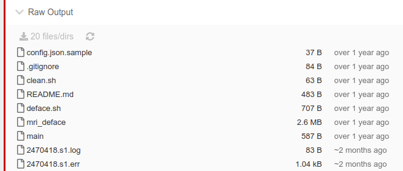
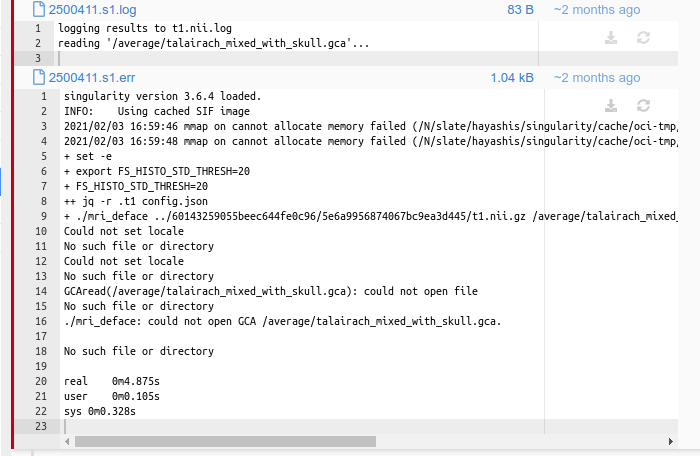
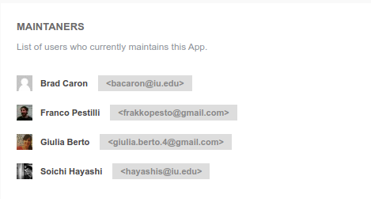
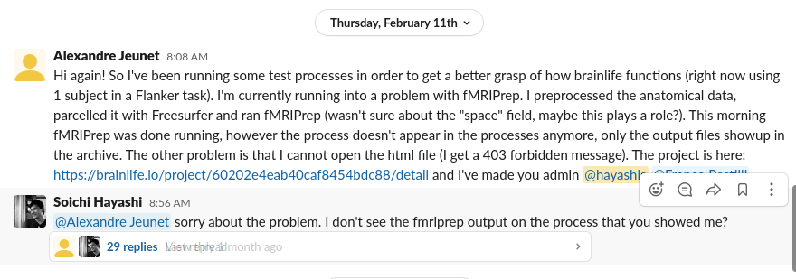
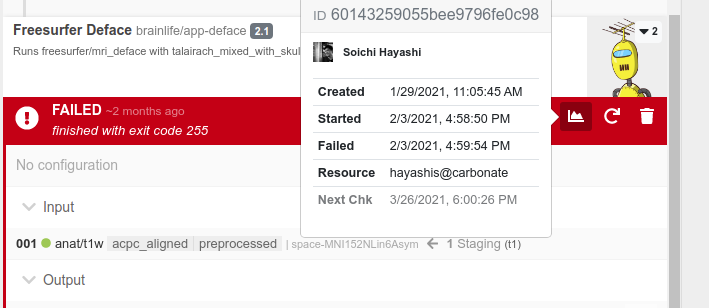

# Handling Job Failure

Your job could fail due to variety of reasons such as 

* There is a bug with the App.
* Something is wrong with your input data.
* Something is wrong with the configuration options you chose.
* Your input data is valid but the App is not designed to ha.
* The App, data, configurations are all correct, but something is (or was) wrong with the compute-resource (either temporary or permanently) that your job ran on.
* A bug with brainlife.io platform itself.
* etc..

Unfortunately, it's up to you to figure out which cases applies to your failure, then perform appropriate action. If the failure is caused by your data/configuration, then you will need to correct those issues and resubmit. If the issue is caused by the bug with the App itself, then you will need to contact the App developer. For compute-resource/platform issued, please contact the brainlife.io team. 

!!! note 
    You are most welcome to contact our [#issues](https://app.slack.com/client/T3X5ND3U1/C6WBY79SB){target=_blank} slack channel to seek assistance. You may also find helpful to search in the slack channel for older messages to see if your issue has already been addressed.

## Finding the error message

To figure out what went wrong, first you need to examine the log files. Click and expand the `Raw Output` section toward the bottom of the job.

Here you can see a list of files produced by the job, and they are sorted based on file modification time. The name of the log depends on the computing resources that it ran on, but normally you should see files with some numbers and file extensions like `.log` or `.err` toward the end.

Click on `.log` and `.err` files to view the contents.

Here is what I see for this particular instance.

According to this, it looks like something went wrong when `mri_deface` command tries to open some file that it needed (`./mri_deface: could not open GCA /average/talairach_mixed_with_skull.gca.`). 

!!! note
    Many programs outputs 2 stream of log files; stdout(`.log`) and stderr(`.err`). The stdout log mainly contains normal output from the App (via echo or print command) and shows what the App was doing and information about status of the job depending of the App. stderr, on the other hand, contains critical error messages and normally you will find more information about the job failure in this log. You will often need to look at both files.

## Handling Application Error

Assuming that this error is caused by a bug with an App, I should now find who the maintainer of this App is, then report this issue to them. 

If you click the App banner at the top of the job, it will take you back to the brainlife's App detail page for this App.

I see these maintainer for this App.

You can contact one of these people via email or slack. Most of the maintainers of the brainlife App are on the brainlife slack, so you can directly contact them post your message on #issue or #general channel to start a conversation (you can use "@someone" to ping that person if you think the person might not be monitoring the channel)

Or you can email them.

If you prefer, you can also file a github issue for the App. You can click the github repo name for the App.

It which takes you to the github page for this App.

Under the `Issues` tab, you can click the `New Issues` button to submit your issue. 

!!! note
    Some Apps might not have `Issues` tab available. A developer can disable `Issues` especially if they want the users to submit issues elsewhere. 

## Handling Resource Errors

Not all job failure is caused by the App itself, but often due to (often temporarily) issues related to the compute-resource. Compute-resource might fail in variety of reasons such as..

* Unrecoverable network / hardware issues
* scratch out of space - where the data is staged
* /tmp out of space on the compute nodes, or any other compute node specific issues
* Resource incompatibility with the App. Some Apps might not work or might failure more often on certain resources. You will need to notify the App developer and see if the App should be un-registered to run on such resources.
* Resource environment issue. Most brainlife app uses to normalize the execution environment. However, when the new version of singularity being installed, or updates to the configuration file might cause issues with some Apps - although it is usually an temporally issue.

If your job fails with error message that doesn't make sense, of fail only on certain resources, you should suspect that the issue is caused by the resource. Most resource issues are temporally, so you could also try resubmitting the job again to see if that solves the issue (Please contact the brainlife.io team to let them know that there might be something wrong with the resource).

You can find out where the job ran by hovering your mouse over the Graph icon.

This particular job ran on a resource `hayashis@carbonate` which is my personal compute-resource that I use for testing. 

