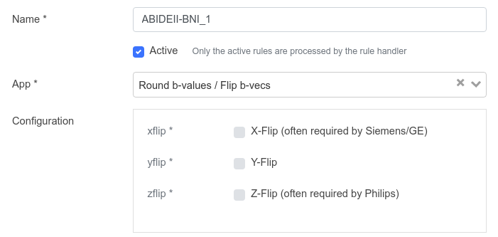
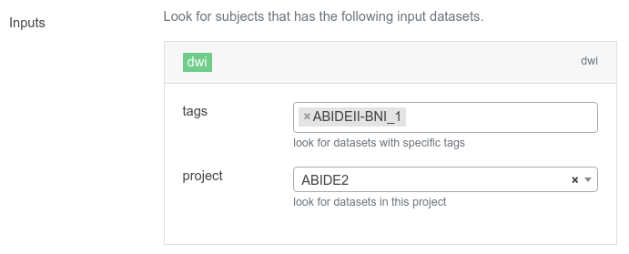
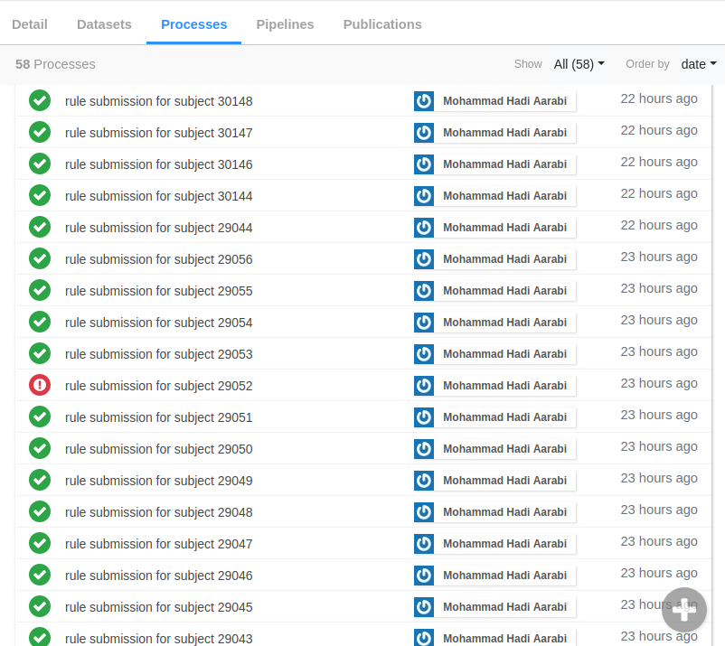
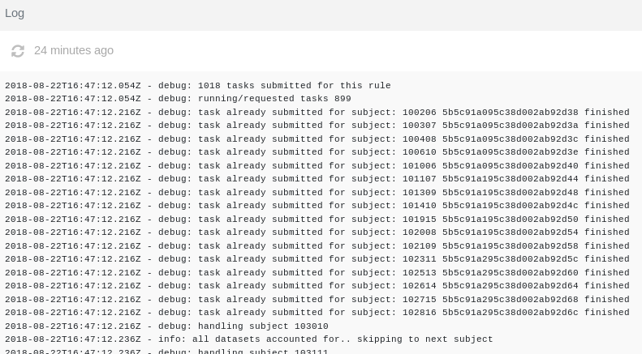

# Pipelines

The `Processes` tab allows you to submit tasks one at a time. This is great if you are exploring different Apps or experimenting with different configurations that can best process your datasets. However, once you find the optimal set of Apps, you would probably want to run it across many subjects and submitting them one by one is simply not a good option.

<!--
When you are processing a large number of subjects, it is often inevitable that some subject would require a different set of configuration, or simply not possible to process at all. This might be due to data quality issues, incorrect metadata, etc. With a common workflow orchestration system, you are often tasked to develop a workflow script or some sort, submit it, and keep up with witch subjects has failed on which part of the workflow so that you can repeatedly re-submit a partial workflow until all subjects are processed.
-->

Brainlife allows you to setup a series of submission rules called *pipeline rules*. Instead of describing the entire workflow that you submit **once** (or re-submit if something fails), you will define a set of individual rules which will be continuously evaluated until you deactivate them. It is similar to how a factory assembly line produces products. When a subject fails to produce an output dataset for a specific rule, you can examine and handle it manually. Once you can produce a valid output, the rest of the pipeline rules will pick it up as if it came from the original rule.

<!--
We believe our rule-based submission system is easier to setup, and more error-tolerant that more conventional orchestration methods (it is also much easier to implement).
-->

## Setting up Pipeline Rule

To setup a new pipeline rule, go to Project > `Pipelines` tab and click a plus button at the bottom right corner of the page.

Each rule will be responsible for submitting a specific App with a specific set of configuration. Enter the `Name` field, and search for the App that you'd like to submit. Once you select an App, you will be able to set its configuration parameters.

All Brainlife Apps have a defined list of input datatypes that Apps needs to run. Using this information, Brainlife will look for any subject that provides all input datatypes required by the App, and submit a new process for each subject found to run your App. If you have more than one dataset that matches the required datatype for a subject, you can specify which datasets to use by specifying a dataset tag (not datatype tags). By default, it will use the latest dataset available for a given datatype.

When you are submitting your first rule, you probably don't have any dataset archived inside your project. If you'd like to use datasets from other projects, you can specify the `Project` field to look for the input datasets there.

The above rule will submit processes for each subject found on ABIDE2 project that provides `dwi` datatype with a dataset tag of "ABIDEII-BNI_1".

Brainlife will only submit a new process if it hasn't submitted a new process for each subject. Brainlife also won't submit a new process if your project already has an output dataset (maybe generated by other rules, or generated manually). To be more specific about which datasets are generated by which rule, you can specify output dataset tags under the outputs section.

You can leave this default if you know you there won't be any other App generating the same output datatype. We recommend to always set output dataset tags just in case.

Lastly, you can set a `Subject Filtering` which limits the subjects that get processed.

The above example will make this rule to only submit for subjects with names that start with "100" or "200". When you are setting up your first rule, it's always good to limit the number of subjects to make sure your rule is set up correctly.

!!! hint
    There are regular expression tutorials available online. Also, please feel free to send us your question via Brainlife slack team.

## Monitoring Pipeline Rules

Once you submit your pipeline rule, it should start submitting processes and you can monitor them under the processes tab.

You can treat these processes as you normally do with any processes that you normally submit manually; examine outputs, stop, restart, etc. The output datasets will be automatically archived once each task has completed successfully.

!!! note
    If you remove a process or task, Brainlife will resubmit another process to handle that subject if the subject has all required input datasets and has not produced the output from the requested app yet. If you don't want them to be resubmitted, please remove or deactivate your rule.

## Turning off pipeline rules

When you turn off the pipeline rule, brainlife will remove all the jobs submitted from the rule. If there are any jobs running that are submitted by the rule, they will be terminated, and any output from the jobs will be removed from the computing resources. 

brainlife.io tries to submit jobs where the input data is already staged to avoid unnecessary data staging / duplication of the input data across different computing resources. When your pipeline rule finishes processing, you should keep the rule turned on until all other rules that uses the rule also finish running.

### Troubleshooting Pipeline Rules

Once you submit your pipeline rule, you can monitor the status of the pipeline under the `Log` section

Information here should help you troubleshoot what Brainlife is doing with your rule, and most importantly, why it's not submitting processes.
