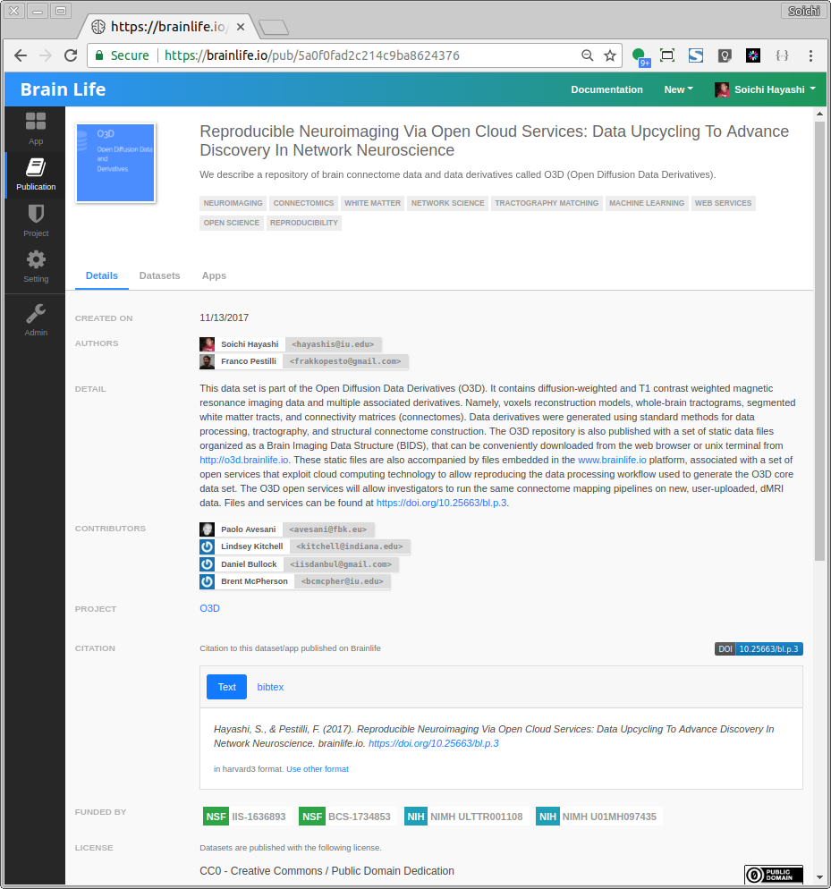
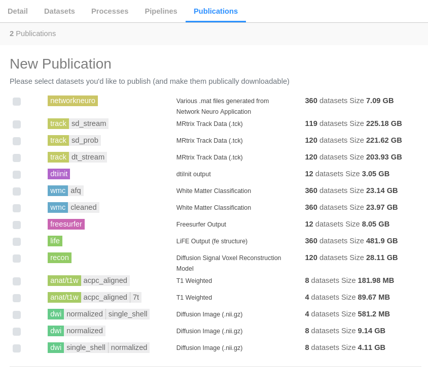

# Publications

Once you finish processing your datasets and produced all data derivatives, you can publish them by creating a current snapshot of your datasets and create a new publication page. 

Publication records at brainlife.io/pubs are preserved for at least ten years. The published data object will be backed on IU  [Scholarly Data Archive](https://kb.iu.edu/d/aiyi){target=_blank} tape archive, and brainlife.io will generate the [schema.org](https://schema.org){target=_blank} metadata to promote maximum discoverability and respect of the [FAIR principles](https://www.go-fair.org/fair-principles/){target=_blank}.

A publication page can be accessed and datasets to be downloaded by anyone on the internet without having to login to Brainlife, except for data that belongs to a project that requires user agreements. For such projects the user must be registered to brainlife and agreed to the list of data access agreements that you specify; published data can not be downloaded without the user credential.

Each publication page may include the following information.

* A permanent-URL for the publication page.
* Unique DOI that redirects to the permanent-URL.
* Publication details such as authors, description, funders, data access license, etc..
* Citation template that visitors can use to cite your publication.
* A list of datasets that you'd like to make it part of your publication. For each dataset listed, visitors can view dataset detail including provenance, App used to generate the dataset and a link to download the dataset.

!!! danger
    Once you publish your dataset, the dataset will become publicly accessible even for a private project. Also, currently, you cannot modify the list of data-objects that are part of the published dataset. Please be careful which data-object to publish. (Please contact brlife@iu.edu if you need any assistance)

## Creating Publication Page

To create a new publication page, go to a project where you want to publish your data, then open to the `Publication` tab. Click the `Plus` button at the bottom right corner of the screen. You should see a list of datatypes and the total file sizes like below.

{}

Select datatypes that you'd like to include in your publication. Click `Next`.

The next page allows you to enter the title, description, and various other metadata. You can edit this information after you publish. When you are done, click `Submit`. The creation of the publication page might take a few minutes depending on the number of data-objects. Brainlife will issue a new DOI from Datacite at this point.

Once you've successfully published your new publication, you should see it listed under the Publications tab under your project as well as the global Publication page which lists all currently registered publications from all projects.
